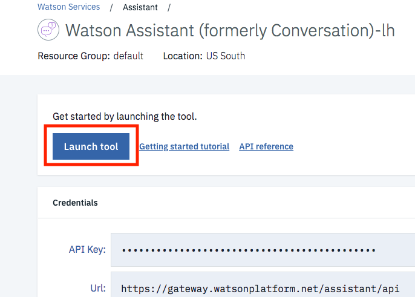
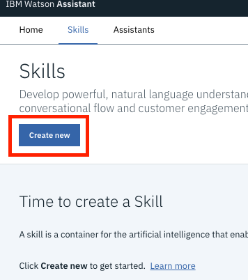
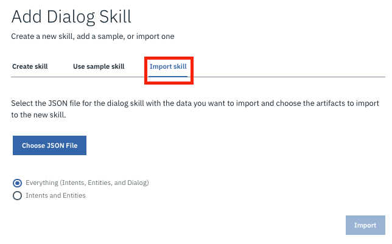
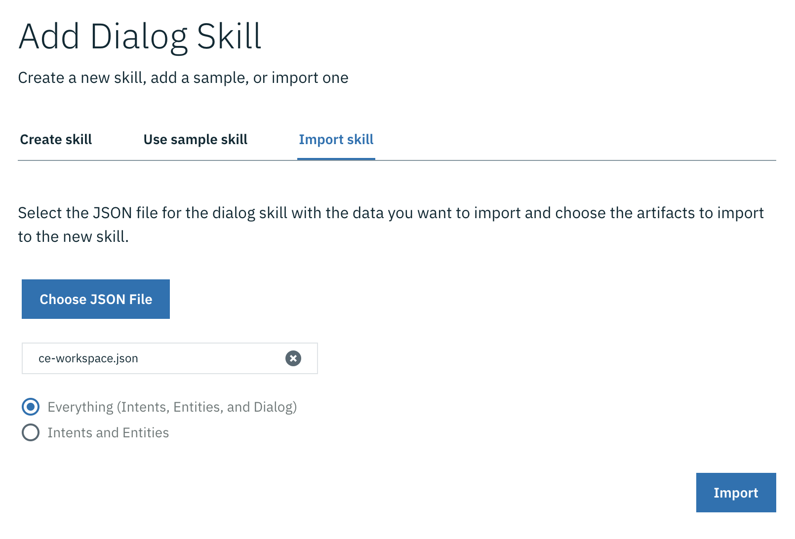
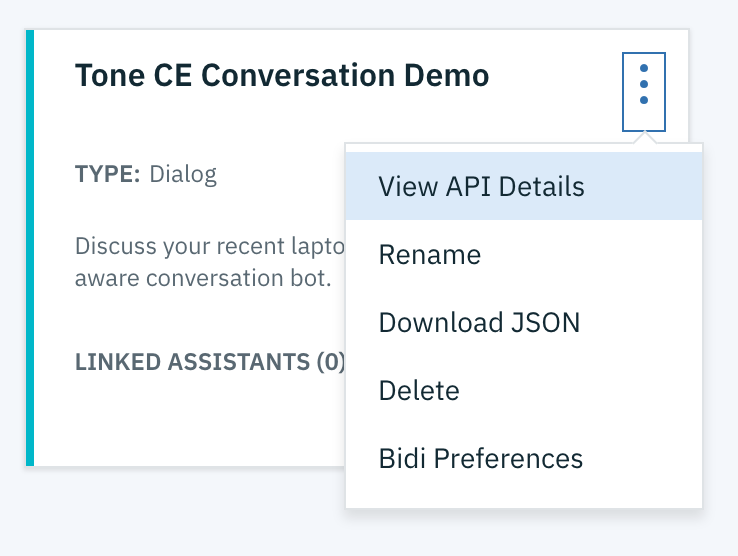

<h1 align="center" style="border-bottom: none;">🚀 Customer Engagement Bot</h1>
<h3 align="center">This application demonstrates how the Watson Assistant service (formerly Conversation) can be adapted to use Tone Analyzer's Customer Engagement feature along with intents and entities in a simple chat interface.</h3>
<p align="center">
  <a href="http://travis-ci.org/watson-developer-cloud/customer-engagement-bot">
    
  </a>
  <a href="#badge">
    
  </a>
</p>
</p>


Demo: http://customer-engagement-bot.mybluemix.net/

For more information on the Watson Assistant (Conversation) service, see the [detailed documentation](https://console.bluemix.net/docs/services/conversation/index.html#about).
For more information on the Tone Analyzer Service, see the [detailed documentation](https://console.bluemix.net/docs/services/tone-analyzer/index.html#about).

## Deploying the application

[](https://greenkeeper.io/)

If you want to experiment with the application or use it as a basis for building your own application, you need to deploy it in your own environment. You can then explore the files, make changes, and see how those changes affect the running application. After making modifications, you can deploy your modified version of the application to IBM Cloud.

## Prerequisites

1. Sign up for an [IBM Cloud account](https://console.bluemix.net/registration/).
1. Download the [IBM Cloud CLI](https://console.bluemix.net/docs/cli/index.html#overview).
1. Create an instance of the Watson Assistant service and get your credentials:
    - Go to the [Watson Assistant](https://console.bluemix.net/catalog/services/conversation) page in the IBM Cloud Catalog.
    - Log in to your IBM Cloud account.
    - Click **Create**.
    - Click **Show** to view the service credentials.
    - Copy the `apikey` value
    - Copy the `url` value.
1. Create an instance of the Tone Analyzer service and get your credentials:
    - Go to the [Tone Analyzer](https://console.bluemix.net/catalog/services/tone-analyzer) page in the IBM Cloud Catalog.
    - Log in to your IBM Cloud account.
    - Click **Create**.
    - Click **Show** to view the service credentials.
    - Copy the `apikey` value
    - Copy the `url` value.

## Configuring the application

1. In your IBM Cloud console, open the Watson Assistant service instance

1.  Click on the  **Launch tool** button to launch into the Watson Assistant tooling.  

    


1.  This is the Watson Assistant tooling where you can create assistants, skills and and setup different chatbots applications. We'll be importing a pre-built skill. **Click on 'Skills'** on the top left, and then on the **Create new** button. 

    

1.  **Click on 'Import Skill'** and then on the **Choose JSON File** button. 

    

1.  Find the workspace JSON file `training/ce-workspace.json` from this repository on your local machine and **Click the 'Import'** button (make sure the **Everything** radio button is selected to import intents, entities and dialog).  

    

1.  You will be redirected into a page with four tabs, Intents, Entities, Dialog, and Content Catalog. For the purposes of this lab, the skill is fairly complete.


1.  To interact with the correct skill, you will  need the unique identifier for your skill.  You can find the workspace ID from the Watson Assistant tooling. From the main Skills page, **Click on the three stacked dots** on the top right of the skill you created/imported. Then **click on the 'View API Details'** option in the menu.

      

    Copy the **Workspace ID** value from this page.

1. In the application folder, copy the *.env.example* file and create a file called *.env*

    ```
    cp .env.example .env
    ```

1. Open the *.env* file and add the service credentials that you obtained for both Watson Assistant and Tone Analyzer in the previous step.

1. Add the `WORKSPACE_ID` to the previous properties

1. Your `.env` file  should looks like:

    ```
    # Environment variables
    WORKSPACE_ID=1c464fa0-2b2f-4464-b2fb-af0ffebc3aab
    ASSISTANT_IAM_APIKEY=_5iLGHasd86t9NddddrbJPOFDdxrixnOJYvAATKi1
    ASSISTANT_URL=https://gateway-syd.watsonplatform.net/assistant/api

    TONE_ANALYZER_IAM_APIKEY=UdHqOFLzoOCFD2M50AbsasdYhOnLV6sd_C3ua5zah
    TONE_ANALYZER_URL=https://gateway-syd.watsonplatform.net/tone-analyzer/api
    ```

## Running locally

1. Install the dependencies

    ```
    npm install
    ```

1. Run the application

    ```
    npm start
    ```

1. View the application in a browser at `localhost:3000`

## Deploying to IBM Cloud as a Cloud Foundry Application

1. Login to IBM Cloud with the [IBM Cloud CLI](https://console.bluemix.net/docs/cli/index.html#overview)

    ```
    ibmcloud login
    ```

1. Target a Cloud Foundry organization and space.

    ```
    ibmcloud target --cf
    ```

1. Edit the *manifest.yml* file. Change the **name** field to something unique.  
  For example, `- name: my-app-name`.
1. Deploy the application

    ```
    ibmcloud app push
    ```

1. View the application online at the app URL.  
For example: https://my-app-name.mybluemix.net

# What to do next

After you have the application installed and running, experiment with it to see how it responds to your input.

## Modifying the application

After you have the application deployed and running, you can explore the source files and make changes. Try the following:

   * Modify the `.js` files to change the application logic.

   * Modify the `.html` file to change the appearance of the application page.

   * Use the Watson Assistant tool to train the service for new intents, or to modify the dialog flow. For more information, see the [Watson Assistant service documentation](https://www.ibm.com/watson/services/conversation/).

# What does the Customer Engagement Bot application do?

The application interface is designed for chatting with a customer engagement bot. Based on a previous laptop purchase, the bot asks how the experience has been and responds accordingly if given a negative or positive response.

The chat interface is in the left panel of the UI, and the JSON response object returned by the Watson Assistant service in the right panel. Your input is run against a small set of sample data trained with the following intents:

    yes
    no
    refund: get a refund on current laptop
    restart: restart the conversation at any point
    tradeIn: replace current laptop with another one
    thanks
    greeting

The dialog is also trained on two types of entities:

    design
    size
    weight

These intents and entities help the bot understand variations your input.

Below you can find some sample interactions:


In order to integrate the Tone Analyzer with the Watson Assistant service (formerly Conversation), the following approach was taken:
   * Intercept the user's message. Before sending it to the Watson Assistant service, invoke the Tone Analyzer Service. See the call to `toneDetection.invokeToneAsync` in the `invokeToneConversation` function in [app.js](./app.js).
   * Parse the JSON response object from the Tone Analyzer Service, and add appropriate variables to the context object of the JSON payload to be sent to the Watson Assistant service. See the `updateUserTone` function in [tone_detection.js](./addons/tone_detection.js).
   * Send the user input, along with the updated context object in the payload to the Watson Assistant service. See the call to `conversation.message` in the `invokeToneConversation` function in [app.js](./app.js).


You can see the JSON response object from the Watson Assistant service in the right hand panel.


In the conversation template, alternative bot responses were encoded based on the user's emotional tone. For example:


## License

This sample code is licensed under Apache 2.0.  
Full license text is available in [LICENSE](LICENSE).

## Contributing

See [CONTRIBUTING](CONTRIBUTING.md).

## Open Source @ IBM

Find more open source projects on the
[IBM Github Page](http://ibm.github.io/).
